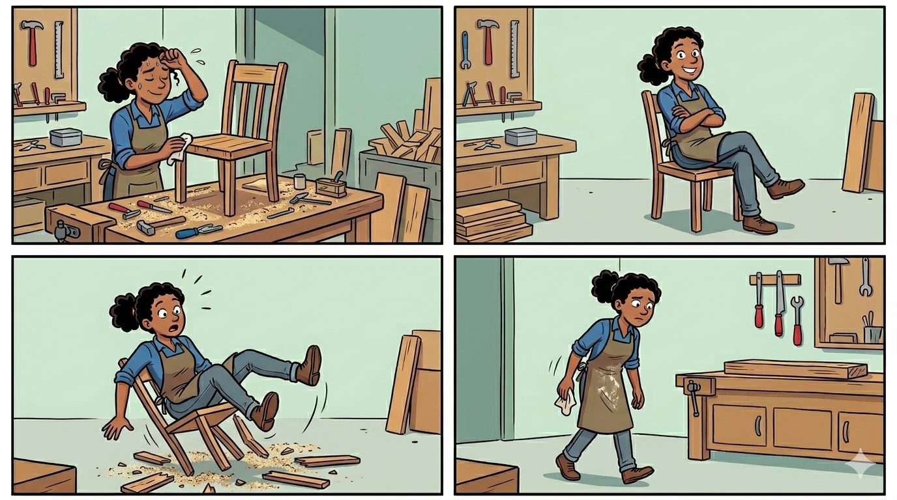
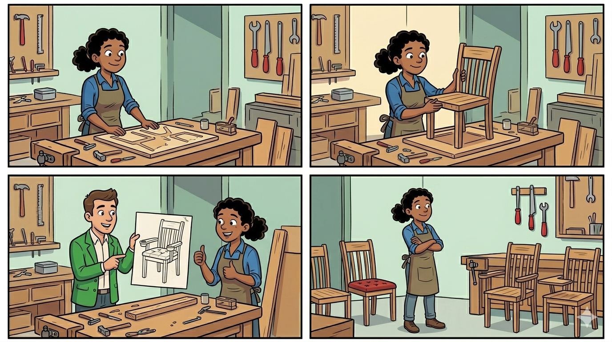

<!-- .slide: class="slide-accent" -->

# Et Craft la chaise !

### De l'optimisation à l'industrialisation

REX  <!-- .element: style="width: 200px; vertical-align: middle; margin-bottom: 0.9em;" -->

**Didier ERIN** · **Laure CHAMPEL** 

Lyon Craft 2026

Notes : blabla

---

<!-- .slide: class="slide-accent" -->

## L'atelier de Liza

 <!-- .element: style="max-height: 65vh;" -->

---

## Qui sommes-nous

  

    
    
<strong>Didier ERIN</strong> Tech lead java Piqué par le Craft depuis 3 ans

  

  

    
    
<strong>Laure CHAMPEL</strong> Engineering manager L'ancrage dans l'organisation de l'atelier

  

*Comment l'atelier de Liza s'est transformé ?*

---

## La douleur et le déclic

### Migration Java 11 → 21

Absence d'une batterie de test pertinente
- Bugs et régressions détectés tardivement 
- Allers-retours dev ↔ recette 
- « Alors, ... qu'est-ce que j'ai cassé ? »

**Il va falloir changer notre façon de travailler** <!-- .element: class="fragment" -->

---

## Quelques mots sur Alptis

Courtier grossiste en assurance

Parcours de vente

Santé individuelle (mutuelle)

---

## La norme

| | |
|---|---|
| **Durée** | 6 à 7 mois / produit |
| **Équipe** | 4-5 personnes (PO, QA, 3 devs) |
| **Produits** | Santé Select, Santé Protect, Santé Pro + |

C'est la norme. Le produit est satisfaisant. <!-- .element: class="fragment" -->

**Mais besoin de produire plus.** <!-- .element: class="fragment" -->

---

<!-- .slide: class="slide-accent" -->

> *On veut produire plus vite,  
mais on serre les fesses quand on s'assoit sur la chaise.*

**Et si le vrai problème n'était pas la vitesse, mais la façon dont on fabrique les chaises ?** <!-- .element: class="fragment" -->

---

## Repartir de zéro avec le craft

**Nouveau produit : Santé Frontaliers Suisses** <!-- .element: class="fragment" data-fragment-index="1" -->

Nouvelle équipe <!-- .element: class="fragment" data-fragment-index="2" -->

**Triple courbe d'apprentissage** <!-- .element: class="fragment" data-fragment-index="3" -->
* TDD <!-- .element: class="fragment" data-fragment-index="3" -->
* La santé individuelle <!-- .element: class="fragment" data-fragment-index="3" -->
* L'environnement Alptis <!-- .element: class="fragment" data-fragment-index="3" -->

---

## Ce qu'on met en place

TDD <!-- .element: class="fragment" -->

Mob programming <!-- .element: class="fragment" -->

US itératives <!-- .element: class="fragment" -->

Livraison continue <!-- .element: class="fragment" -->

Périmètre allégé <!-- .element: class="fragment" -->

---

<!-- .slide: class="slide-accent" -->

## L'apprentissage

 <!-- .element: style="max-height: 65vh;" -->

---

## Ce qui se passe vraiment

  

    Mob
    ~1,5 mois
  

  

    Pair
    ~2 mois
  

  

    Hybride
    ~1,5 mois
  

  

    Sans Didier
    ~2 mois
  

---

## Comme si ça ne suffisait pas ... 

Un besoin de standardisation mal exprimé à l'équipe <!-- .element: class="fragment" -->

Des dépendances avec des équipes externes <!-- .element: class="fragment" -->

---

## 7 mois — résultat contrasté

dont 1 mois de retard

<blockquote class="fragment"><em>Mais on desserre les fesses.</em></blockquote>

On livre sûr et simplifié, on peut aller plus vite <!-- .element: class="fragment" -->

---

## Le métier vient à nous

Nouveau produit à sortir.

*"Comment aller plus vite ?"*

*"Si toutes les chaises ont les mêmes pieds, ça ira vite."* <!-- .element: class="fragment" -->

*"OK pour les mêmes pieds."* <!-- .element: class="fragment" -->

---

## La décision

- Nouveau produit très similaire
- Code stable et testé
- Base saine pour des adaptations rapides

**Décision : dupliquer Santé Frontaliers Suisses** <!-- .element: class="fragment" -->

---

## Santé Équilibre en 3 mois

2 mois : produit quasi complet

→ La recette devient le goulot d'étranglement <!-- .element: class="fragment" -->

→ Des retours imputables à Santé Frontaliers Suisses <!-- .element: class="fragment" -->

→ simulation des services externes à la demande <!-- .element: class="fragment" -->

**"Mais alors ? L'industrialisation devient rationnelle !"** <!-- .element: class="fragment" -->

---

## Le déclic du template

Un produit interne vivant, recetté, toujours à jour.

200 jours alloués à la création de ce template <!-- .element: class="fragment" --> 

Objectif DSI 2026 : produire un parcours de vente en <!-- .element: class="fragment" --> 

**150 jours**  <!-- .element: class="fragment" -->

---

<!-- .slide: class="slide-accent" -->

## L'atelier, aujourd'hui

 <!-- .element: style="max-height: 50vh;" -->

---

<!-- .slide: class="slide-accent" -->

## Merci

  

    
    
<strong>Didier ERIN</strong>

  

  

    
    
<strong>Laure CHAMPEL</strong>

  

Lyon Craft 2026
