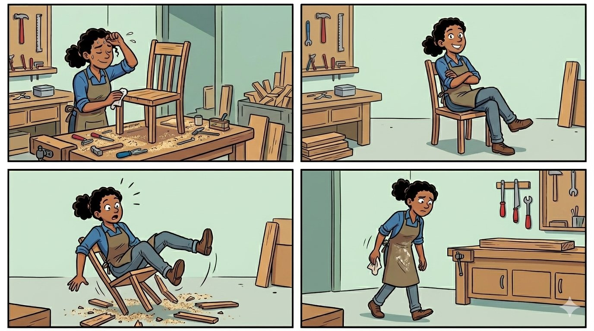
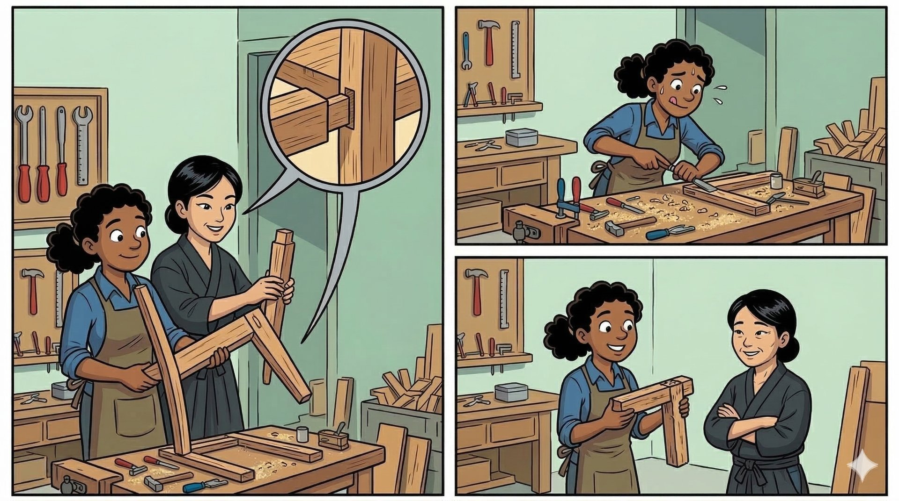
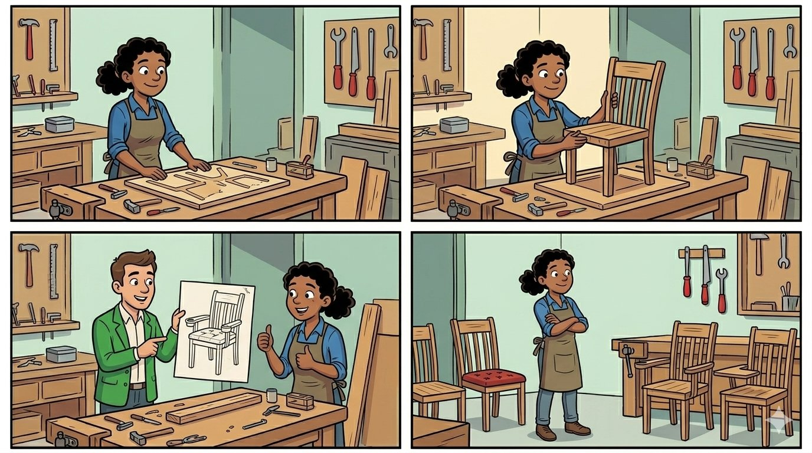

<!-- .slide: data-background="#0d1b2a" -->

# Et Craft la chaise

### REX Alptis — Le TDD, de l'optimisation à l'industrialisation

 <!-- .element: style="width: 200px; margin-top: 2em;" -->

**Didier** · **Laure** — Lyon Craft 2026

Note: Slide de titre. Laisser la salle s'installer.

---

<!-- .slide: data-background="#0d1b2a" -->

## L'atelier

 <!-- .element: style="max-height: 70vh;" -->

Note: Didier. Vignette 1 : on a fini la chaise, on s'assoit. Vignette 2 : ça craque. Vignette 3 : retour à l'établi. « C'est pas de la négligence — c'est comme ça qu'on a toujours fait. »

---

## La douleur et le déclic

Migration Java 11 → 21 en cours. Bugs et régressions détectés tardivement.

Allers-retours dev ↔ recette. Cycles qui s'étirent.

L'envie d'aller plus vite existe — mais sans filet, chaque accélération reste un pari.

Note: Duo (Laure lead, Didier réagit). L : migration, bugs tard, allers-retours. D : incertitude « qu'est-ce que j'ai cassé ? », recette rallongée par précaution. D : c'est cette douleur qui fait émerger l'idée.

---

## Qui sommes-nous

**Didier** — l'artisan qui arrive, impulse le craft, structure les pivots

**Laure** — l'ancrage dans l'organisation, la continuité après le départ de Didier

*On va vous raconter comment cet atelier s'est transformé.*

Note: Duo — chacun se présente en une phrase. D : freelance craft, proposition de repartir sur des bases saines. L : [rôle — à compléter]. Continuité post-départ Didier.

---

## La norme

| | |
|---|---|
| **Durée** | 6 à 7 mois / produit |
| **Équipe** | 4-5 personnes (PO, SA, 3 dev) |
| **Produits** | Select, Protect, Select Pro |

C'est la norme. Ça fonctionne. Personne ne la remet en question.

Note: Laure. Confirmé sur 3 produits. Ça fonctionne, personne ne remet en question.

---

<!-- .slide: data-background="#1a1a2e" -->

> *"On veut produire plus vite, mais on serre les fesses quand on s'assoit dessus."*

Et si le vrai problème n'était pas la vitesse à laquelle on fabrique — mais **la façon** dont on fabrique ?

Note: Didier. Écho au craquement de la slide 2. La question ouvre l'acte 2.

---

## Le pari : SFR

**Santé Frontaliers Suisses** — nouveau produit, from scratch.

Équipe nouvelle — zéro expérience Alptis.

Double courbe d'apprentissage : **craft** + **contexte métier**.

Note: Duo (L puis D). L : équipe nouvelle, zéro expérience Alptis. D : double pari craft + contexte métier. Pas un labo, un vrai produit avec une vraie date.

---

## Ce qu'on met en place

- **TDD** — conception émergente, code construit par petits pas, refactoré en continu
- **Mob programming** — montée en compétence craft et fonctionnelle, en temps réel
- **US itératives** — pas de cahier des charges figé, le produit émerge par incréments
- **Livraison continue en prod** — on déploie tout au long du projet
- **Allègement du périmètre** — focus sur le cœur métier

Note: Didier. Donner le pourquoi de chaque levier, pas juste le quoi.

---

## Ce qui se passe vraiment

```
Mob (~1,5 mois) → Pair (~1,5 mois) → Hybride (~1 mois) → Sans Didier (~2 mois)
```

~3 semaines de friction organisationnelle. Congés successifs. TDD lâché sous pression de deadline sur certaines zones.

Note: Duo (D puis L). D : détailler les 4 phases, insister sur les 2 derniers mois (TDD lâché sous pression). L : ~3 semaines de friction orga (standardisation produit). D : côté front — 1 dev formé en pair, adopte le TDD en autonomie.

---

## 7 mois — résultat contrasté

# 7 mois

*dont 1 mois de retard*

| Craft tenu | Craft lâché |
|---|---|
| Intention garantie | Modules éprouvés |
| Pas de régression | Retour à la dépendance recette |

> *"On a mis 7 mois. Mais on desserre les fesses."*

*"Pour aller plus vite, il faut apprendre à livrer sûr."*

Note: Didier. Rappeler le contexte : équipe neuve, friction orga, double apprentissage → en conditions normales ~6 mois. Thèse : « pour aller plus vite, il faut apprendre à livrer sûr ».

---

<!-- .slide: data-background="#0d1b2a" -->

## L'apprentissage

 <!-- .element: style="max-height: 70vh;" -->

Note: Didier. Vignette 1 : le maître artisan montre les techniques. Vignette 2 : l'apprentie essaye. Vignette 3 : pas encore à l'aise, mais quelque chose a changé.

---

## Le renversement : le métier vient à nous

On reçoit une invitation à une réunion. Objectif flou.

On arrive — et on comprend : le métier nous demande **comment concevoir le produit pour minimiser le temps de réalisation**.

*"Si x, ça ira vite. Si y, il nous faudra plus de temps — on préconise x."*

→ *"OK pour x."*

Note: Laure. Raconter l'anecdote. Ce renversement a pris des années — le craft seul ne suffit pas.

---

## Santé Équilibre

# 2 mois

version quasi complète en prod — recette comprise — périmètre plus complet que SFR

# + 1 mois

branchements services externes

> *"Le goulot s'est déplacé : du développement vers la recette et les dépendances externes."*

*"Quand le changement devient maîtrisé, l'industrialisation devient rationnelle."*

Note: Didier. Duplication SFR : tests + structure du code. Nouveau levier : découplage services externes. En recette : quasi aucun retour. Le dev n'est le goulot à aucun moment.

---

## Le déclic du template

Un produit vivant, recetté, toujours à jour.

Chaque nouveau produit part du template — les déclinaisons se concentrent sur les **spécificités**.

**Objectif DSI 2026** : parcours de vente en **150 jours** *(budget 200j)*

Note: Laure. Template vivant, corrections sur produit ET template. Formation TDD en cours hors équipe expérimentale. L'organisation a internalisé.

---

<!-- .slide: data-background="#0d1b2a" -->

## L'atelier, aujourd'hui

 <!-- .element: style="max-height: 50vh;" -->

> *"Développer est un métier.*
>
> *Être artisan développeur en est un autre."*

Note: Duo (D puis L). Vignette 1 : l'atelier transformé, les chaises tiennent. Vignette 2 : on se concentre sur la personnalisation. Punchline après silence. L : « Merci ».

---

<!-- .slide: data-background="#0d1b2a" -->

## Merci

**Didier** · **Laure**

Lyon Craft 2026
